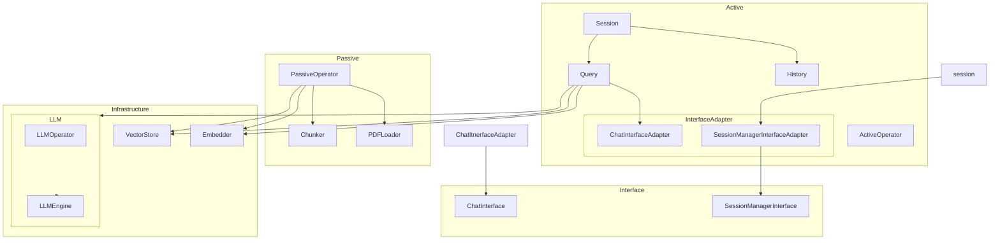

```mermaid
graph TD

subgraph Interface
    ChatInterface
    SessionManagerInterface
end

subgraph Active
    ActiveOperator    
    Session
    Query
    History
    subgraph InterfaceAdapter
        ChatInterfaceAdapter
        SessionManagerInterfaceAdapter
    end
end

subgraph Passive
    PassiveOperator
    Chunker
    PDFLoader
end

subgraph Infrastructure
    subgraph LLM
        LLMOperator
        LLMEngine
    end
    VectorStore
    Embedder
end

Session --> Query
Session --> History
session --> SessionManagerInterfaceAdapter
Query --> ChatInterfaceAdapter
Query --> LLM
Query --> Embedder
Query --> VectorStore

SessionManagerInterfaceAdapter --> SessionManagerInterface
ChatItnerfaceAdapter --> ChatInterface


PassiveOperator --> Chunker
PassiveOperator --> PDFLoader
PassiveOperator --> Embedder
PassiveOperator --> VectorStore


LLM --> LLMEngine

```
